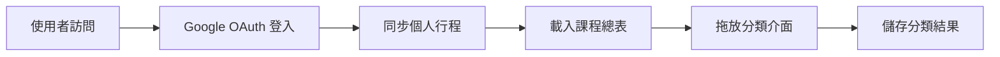
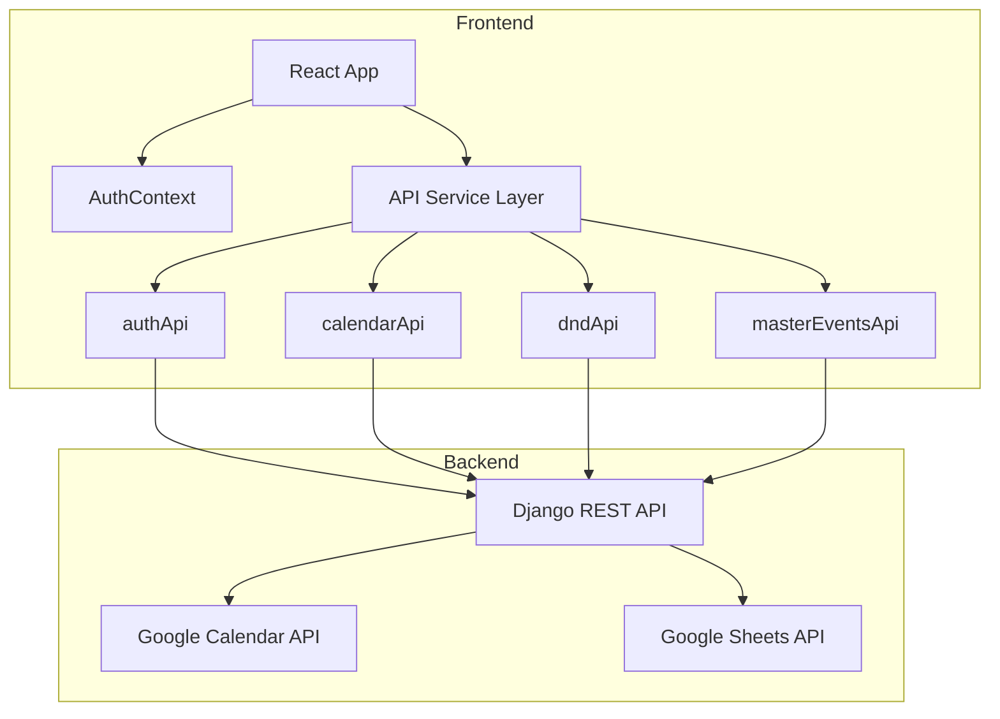
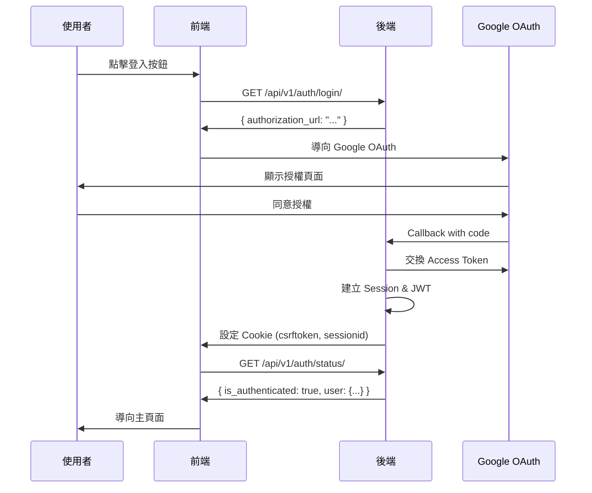

# 前端框架與規範說明文件

> **文件用途**: 提供給後端開發團隊，說明前端架構、技術棧、API 整合規範與資料流程  
> **專案名稱**: CTCE-37 - 課程拖放分類系統  
> **最後更新**: 2025-11-26

---

## 📋 目錄

1. [專案概述](#專案概述)
2. [技術架構](#技術架構)
3. [專案結構](#專案結構)
4. [資料模型與 TypeScript 型別](#資料模型與-typescript-型別)
5. [API 整合規範](#api-整合規範)
6. [認證流程](#認證流程)
7. [核心功能模組](#核心功能模組)
8. [前端開發規範](#前端開發規範)
9. [部署與環境設定](#部署與環境設定)

---

## 專案概述

### 功能描述

本專案是一個**課程行事曆拖放分類系統**，主要功能包括：

- **Google OAuth 認證**: 使用者透過 Google 帳號登入
- **行事曆同步**: 從 Google Calendar 同步個人行程
- **課程總表管理**: 從 Google Spreadsheet 讀取課程清單
- **拖放分類**: 將個人行程拖放到課程上進行歸類
- **週視圖顯示**: 以週為單位顯示行程與分類結果

### 使用者流程



---

## 技術架構

### 前端技術棧

| 技術 | 版本 | 用途 |
|------|------|------|
| **React** | 19.1.1 | UI 框架 |
| **TypeScript** | 4.9.5 | 型別安全 |
| **React Router** | 7.8.2 | 路由管理 |
| **@dnd-kit** | 6.3.1 | 拖放功能 |
| **Lucide React** | 0.542.0 | 圖示庫 |
| **React Scripts** | 5.0.1 | 建置工具 (CRA) |

### 後端整合

- **Base URL**: `http://localhost:8000`
- **API 版本**: `/api/v1/`
- **認證方式**: JWT Token (存於 Cookie)
- **CSRF 保護**: 使用 `csrftoken` Cookie
- **資料格式**: JSON

### 架構圖



---

## 專案結構

```
CTCE-37/
├── public/                    # 靜態資源
├── src/
│   ├── components/           # React 元件
│   │   ├── LoginPage.tsx    # 登入頁面
│   │   ├── WeeklyCategorization.tsx  # 主要拖放介面
│   │   ├── TaskCard.tsx     # 個人行程卡片
│   │   ├── MasterEventCard.tsx  # 課程卡片
│   │   └── EventModal.tsx   # 事件詳情彈窗
│   ├── contexts/
│   │   └── AuthContext.tsx  # 認證狀態管理
│   ├── services/
│   │   └── api.ts           # API 整合層 ⭐ 重要
│   ├── types.ts             # TypeScript 型別定義 ⭐ 重要
│   ├── App.tsx              # 主應用程式
│   └── index.tsx            # 應用程式入口
├── package.json             # 依賴管理
├── tsconfig.json            # TypeScript 設定
├── BACKEND_SETUP.md         # 後端 API 文件
└── apidoc.md                # API 端點一覽表
```

### 關鍵檔案說明

#### `src/services/api.ts` ⭐

**用途**: 所有 API 呼叫的統一入口，包含錯誤處理、CSRF Token 管理

**主要模組**:
- `authApi`: 認證相關 API
- `calendarApi`: 行事曆與事件 API
- `dndApi`: 拖放分類 API
- `masterEventsApi`: 課程總表 API

#### `src/types.ts` ⭐

**用途**: 定義所有資料模型的 TypeScript 型別，確保前後端資料格式一致

---

## 資料模型與 TypeScript 型別

### 核心資料模型

#### 1. User (使用者)

```typescript
interface User {
  id: number;
  username: string;
  email: string;
  first_name: string;
  last_name: string;
  date_joined?: string;
  is_google_authenticated?: boolean;
  google_email?: string;
  token_expires_at?: string;
}
```

#### 2. CalendarEvent (個人行程)

```typescript
interface CalendarEvent {
  id: number;
  user: User;
  google_event_id: string;
  title: string;
  description: string;
  start_datetime: string;        // ISO 8601 格式
  end_datetime: string;          // ISO 8601 格式
  location: string;
  is_all_day: boolean;
  recurrence_rule: string | null;
  calendar_id: string;
  status: string;
  created_at: string;
  updated_at: string;
  synced_with_google: boolean;
  last_synced_at: string;
  event_type?: 'personal' | 'master';
  synced_at?: string;
}
```

**重要欄位說明**:
- `google_event_id`: Google Calendar 的事件 ID
- `start_datetime` / `end_datetime`: 統一使用 ISO 8601 格式 (e.g., `2025-11-26T09:00:00Z`)
- `is_all_day`: 全天事件標記
- `event_type`: 區分個人行程 (`personal`) 與課程 (`master`)

#### 3. MasterEvent (課程總表)

```typescript
interface MasterEvent {
  id: number;                      // 資料庫 ID (用於 API 呼叫)
  user: User;
  spreadsheet_row_id: number;      // Google Sheet 課程 ID
  title: string;                   // 課程名稱
  description: string;             // 課程說明
  location: string;                // 上課地點
  event_type: 'master';            // 固定為 'master'
  created_at: string;
  updated_at: string;
  synced_at: string;               // 最後同步時間
}
```

**重要欄位說明**:
- `id`: 資料庫主鍵，用於拖放時的 `master_event_id`
- `spreadsheet_row_id`: Google Spreadsheet 中的課程 ID (Column A)
- `title`: 從 Google Spreadsheet Column D 讀取

#### 4. EventCategorization (拖放分類關係)

```typescript
interface EventCategorization {
  id: number;
  master_event: CalendarEvent;     // 課程 (MasterEvent)
  personal_event: CalendarEvent;   // 個人行程
  notes?: string;
  position_x?: number;             // UI 位置 (可選)
  position_y?: number;             // UI 位置 (可選)
  created_at: string;
}
```

**關聯說明**:
- 一個 `personal_event` 可以被分類到一個 `master_event`
- `position_x` / `position_y`: 用於記錄拖放後的 UI 位置

---

## API 整合規範

### API 請求標準格式

#### 請求 Headers

```javascript
{
  'Content-Type': 'application/json',
  'Accept': 'application/json',
  'X-CSRFToken': csrfToken,  // POST/PUT/DELETE 必須
  // Cookie 會自動帶上 (credentials: 'include')
}
```

#### 錯誤處理

前端使用統一的錯誤處理機制 (`handleResponse` 函數):

```javascript
// HTTP 狀態碼對應
401 → "Authentication required. Please log in again."
403 → "Access forbidden. Please check your permissions..."
404 → "Resource not found. The requested endpoint may not exist."
500 → "Server error. Please try again later."
```

**後端需確保**:
- 錯誤回應包含 `error` 或 `message` 或 `detail` 欄位
- 回應格式為 JSON
- 適當的 HTTP 狀態碼

### API 模組說明

#### 1. authApi (認證 API)

| 方法 | 端點 | 說明 | 前端使用時機 |
|------|------|------|-------------|
| `login()` | `GET /api/v1/auth/login/` | 取得 Google OAuth URL | 使用者點擊登入按鈕 |
| `checkAuthStatus()` | `GET /api/v1/auth/status/` | 檢查認證狀態 | App 初始化、路由守衛 |
| `refreshToken()` | `POST /api/v1/auth/refresh/` | 更新 Access Token | Token 過期時 |
| `logout()` | `POST /api/v1/auth/logout/` | 登出 | 使用者點擊登出 |

**範例: 檢查認證狀態**

```typescript
// 前端呼叫
const authStatus = await authApi.checkAuthStatus();

// 後端應回應
{
  "is_authenticated": true,
  "user": {
    "id": 1,
    "username": "user@example.com",
    "email": "user@example.com",
    "first_name": "John",
    "last_name": "Doe"
  },
  "has_google_token": true,
  "token_expired": false
}
```

#### 2. calendarApi (行事曆 API)

| 方法 | 端點 | 說明 | 前端使用時機 |
|------|------|------|-------------|
| `getWeeklyPersonalEvents()` | `GET /api/v1/calendar/personal-events/weekly/` | 取得本週個人行程 | 主介面載入 |
| `syncPersonalEvents()` | `POST /api/v1/calendar/personal-events/sync/` | 手動同步 Google Calendar | 使用者點擊同步按鈕 |
| `getSyncStatus()` | `GET /api/v1/calendar/sync/status/` | 查詢同步狀態 | 顯示同步資訊 |

**範例: 取得本週行程**

```typescript
// 前端呼叫
const response = await calendarApi.getWeeklyPersonalEvents(0); // 0 = 本週

// 後端應回應
{
  "success": true,
  "events": [
    {
      "id": 1,
      "title": "會議",
      "start_datetime": "2025-11-26T09:00:00Z",
      "end_datetime": "2025-11-26T10:00:00Z",
      "is_all_day": false,
      "event_type": "personal",
      ...
    }
  ],
  "events_count": 15,
  "week_start": "2025-11-24T00:00:00Z",
  "week_end": "2025-11-30T23:59:59Z",
  "last_synced": "2025-11-26T08:00:00Z",
  "data_source": "database"
}
```

#### 3. masterEventsApi (課程總表 API)

| 方法 | 端點 | 說明 | 前端使用時機 |
|------|------|------|-------------|
| `syncMasterEvents()` | `POST /api/v1/calendar/master-events/sync/` | 從 Google Sheets 同步課程 | 首次使用或課程更新 |
| `getMasterEvents()` | `GET /api/v1/calendar/master-events/list/` | 取得課程列表 | 主介面載入 |
| `getMasterEventDetail()` | `GET /api/v1/calendar/master-events/{id}/` | 取得課程詳情 | 查看課程詳細資訊 |

**範例: 同步課程總表**

```typescript
// 前端呼叫
const response = await masterEventsApi.syncMasterEvents();

// 後端應回應
{
  "success": true,
  "message": "成功同步 15 個課程",
  "deleted_count": 0,
  "created_count": 5,
  "updated_count": 10,
  "synced_at": "2025-11-26T10:30:00Z",
  "spreadsheet_info": {
    "spreadsheet_id": "1RgLFR-0k9sEETiymipAMUKB4EbAVj4ebFI7UuF7HXr4",
    "sheet_name": "課程總表",
    "total_rows": 15
  }
}
```

**範例: 取得課程列表**

```typescript
// 前端呼叫 (快取模式)
const response = await masterEventsApi.getMasterEvents(false);

// 前端呼叫 (強制刷新)
const response = await masterEventsApi.getMasterEvents(true);

// 後端應回應
{
  "success": true,
  "events": [
    {
      "id": 1,
      "spreadsheet_row_id": 101,
      "title": "Python 程式設計",
      "description": "課程 ID: 101",
      "location": "教室 A",
      "event_type": "master",
      "synced_at": "2025-11-26T10:30:00Z"
    }
  ],
  "events_count": 15,
  "last_synced": "2025-11-26T10:30:00Z",
  "source": "database",  // 或 "google_spreadsheet"
  "spreadsheet_info": {
    "spreadsheet_id": "1RgLFR-0k9sEETiymipAMUKB4EbAVj4ebFI7UuF7HXr4",
    "sheet_name": "課程總表",
    "total_rows": 15
  }
}
```

#### 4. dndApi (拖放分類 API)

| 方法 | 端點 | 說明 | 前端使用時機 |
|------|------|------|-------------|
| `getCalendarData()` | `GET /api/v1/calendar/dnd/calendar-data/` | 取得拖放所需資料 | 主介面載入 |
| `createCategorization()` | `POST /api/v1/calendar/dnd/categorize/` | 建立分類關係 | 拖放完成時 |
| `updateCategorizationPosition()` | `PUT /api/v1/calendar/dnd/categorize/{id}/position/` | 更新位置 | 移動已分類事件 |
| `removeCategorization()` | `DELETE /api/v1/calendar/dnd/categorize/{id}/` | 刪除分類 | 取消分類 |

**範例: 建立分類關係**

```typescript
// 前端呼叫
const response = await dndApi.createCategorization({
  personal_event_id: 123,
  master_event_id: 456,
  position_x: 100,
  position_y: 200,
  notes: "備註"
});

// 後端應回應
{
  "success": true,
  "created": true,
  "categorization": {
    "id": 789,
    "master_event": { ... },
    "personal_event": { ... },
    "notes": "備註",
    "position_x": 100,
    "position_y": 200,
    "created_at": "2025-11-26T11:00:00Z"
  },
  "message": "分類建立成功"
}
```

---

## 認證流程

### Google OAuth 登入流程



### 前端認證狀態管理 (AuthContext)

```typescript
// src/contexts/AuthContext.tsx
const AuthContext = React.createContext({
  authStatus: null,
  loading: true,
  checkAuth: async () => {},
  logout: async () => {}
});

// 使用方式
const { authStatus, loading } = useAuth();
if (authStatus?.is_authenticated) {
  // 已登入
}
```

### 路由守衛 (ProtectedRoute)

```typescript
// 未登入自動導向 /login
<ProtectedRoute>
  <WeeklyCategorization />
</ProtectedRoute>
```

---

## 核心功能模組

### 1. 週視圖拖放介面 (WeeklyCategorization)

**檔案**: `src/components/WeeklyCategorization.tsx`

**功能**:
- 顯示本週個人行程 (週日~週六)
- 顯示課程總表
- 拖放個人行程到課程進行分類
- 顯示已分類的關係

**資料載入流程**:

```typescript
useEffect(() => {
  // 1. 載入本週個人行程
  const eventsData = await calendarApi.getWeeklyPersonalEvents(0);
  
  // 2. 載入課程總表
  const masterData = await masterEventsApi.getMasterEvents(false);
  
  // 3. 載入已分類資料
  const dndData = await dndApi.getCalendarData();
  
  // 4. 渲染 UI
}, []);
```

### 2. 拖放功能 (@dnd-kit)

**使用的套件**:
- `@dnd-kit/core`: 核心拖放邏輯
- `@dnd-kit/sortable`: 排序功能
- `@dnd-kit/utilities`: 工具函數

**拖放事件處理**:

```typescript
const handleDragEnd = async (event) => {
  const { active, over } = event;
  
  if (over) {
    // active.id = personal_event_id
    // over.id = master_event_id
    
    await dndApi.createCategorization({
      personal_event_id: active.id,
      master_event_id: over.id,
      position_x: 0,
      position_y: 0
    });
  }
};
```

---

## 前端開發規範

### 1. API 呼叫規範

✅ **正確做法**:

```typescript
// 使用 api.ts 中的封裝函數
import { calendarApi } from '../services/api';

const events = await calendarApi.getWeeklyPersonalEvents(0);
```

❌ **錯誤做法**:

```typescript
// 不要直接使用 fetch
const response = await fetch('http://localhost:8000/api/v1/...');
```

### 2. 錯誤處理規範

```typescript
try {
  const data = await calendarApi.getWeeklyPersonalEvents(0);
  
  if (!data.success) {
    console.error('API 錯誤:', data.error);
    // 顯示錯誤訊息給使用者
  }
} catch (error) {
  if (error instanceof ApiError) {
    if (error.status === 401) {
      // 導向登入頁面
      navigate('/login');
    } else {
      // 顯示錯誤訊息
      alert(error.message);
    }
  }
}
```

### 3. 時間格式處理

**後端應統一使用 ISO 8601 格式**:
- `2025-11-26T09:00:00Z` (UTC)
- `2025-11-26T09:00:00+08:00` (含時區)

**前端處理**:

```typescript
// 後端回傳的時間字串
const event = {
  start_datetime: "2025-11-26T09:00:00Z"
};

// 前端轉換為 Date 物件
const startTime = new Date(event.start_datetime);

// 顯示本地時間
const localTime = startTime.toLocaleString('zh-TW');
```

### 4. 型別安全

**所有 API 回應都應符合 `types.ts` 中定義的型別**

範例:

```typescript
// types.ts
export interface WeeklyEventsResponse {
  success: boolean;
  events: CalendarEvent[];
  events_count: number;
  week_start: string;
  week_end: string;
}

// 後端必須確保回應格式完全符合
```

---

## 部署與環境設定

### 開發環境

```bash
# 安裝依賴
npm install

# 啟動開發伺服器 (port 3000)
npm start

# 建置生產版本
npm run build
```

### 環境變數

**前端 Base URL 設定**:

```typescript
// src/services/api.ts
const BASE_URL = 'http://localhost:8000';  // 開發環境

// 生產環境應改為
const BASE_URL = process.env.REACT_APP_API_URL || 'https://api.example.com';
```

### CORS 設定要求

**後端需設定**:

```python
# Django settings.py
CORS_ALLOWED_ORIGINS = [
    "http://localhost:3000",  # 前端開發伺服器
]

CORS_ALLOW_CREDENTIALS = True  # 允許 Cookie

CSRF_TRUSTED_ORIGINS = [
    "http://localhost:3000",
]
```

### Cookie 設定要求

**後端 Session Cookie 設定**:

```python
SESSION_COOKIE_SAMESITE = 'Lax'
SESSION_COOKIE_HTTPONLY = True
CSRF_COOKIE_SAMESITE = 'Lax'
CSRF_COOKIE_HTTPONLY = False  # 前端需讀取 CSRF token
```

---

## 附錄

### A. 完整 API 端點列表

請參考 [apidoc.md](./apidoc.md)

### B. 後端 API 詳細文件

請參考 [BACKEND_SETUP.md](./BACKEND_SETUP.md)

### C. 常見問題

#### Q1: 前端如何處理 Token 過期?

```typescript
// AuthContext 會自動檢查認證狀態
// 若 Token 過期，會導向登入頁面
```

#### Q2: 拖放時如何確保資料一致性?

```typescript
// 拖放完成後立即重新載入資料
await dndApi.createCategorization(...);
await loadCalendarData();  // 重新載入
```

#### Q3: 如何測試 API 整合?

```bash
# 確保後端已啟動在 port 8000
# 前端啟動在 port 3000
npm start

# 檢查瀏覽器 Console 的 API 請求 log
```

---

## 聯絡資訊

如有任何問題，請聯絡前端開發團隊。

**文件版本**: 1.0  
**建立日期**: 2025-11-26
